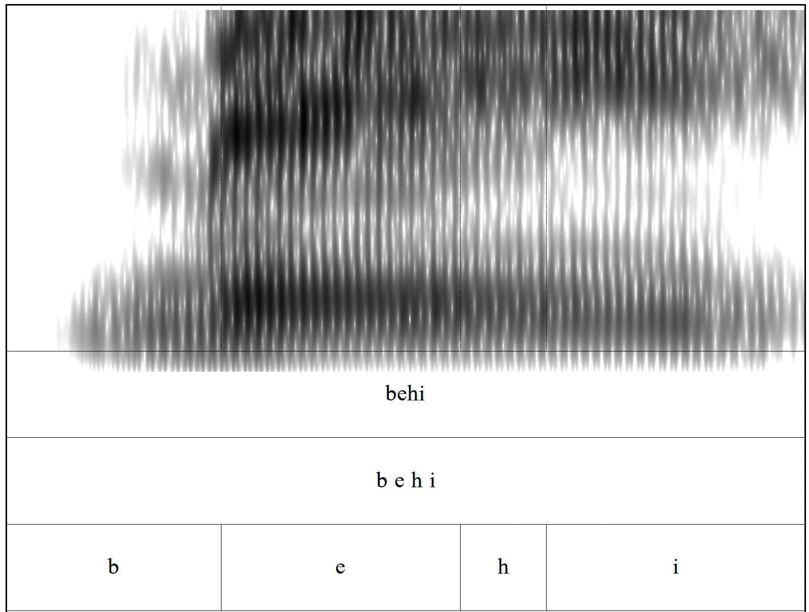

```{r setup, include=FALSE} 
options(htmltools.dir.version = FALSE)
knitr::opts_chunk$set(echo = FALSE)
```
```{r xaringanExtra}
xaringanExtra::use_webcam()
xaringanExtra::use_tile_view()
```


name: xaringan-title
class: right, middle
background-image: url(img/logo-cnrs.png), url(img/logo-iker.png), url(img/logo-lmu.png), url(img/logo-ehu-gardena-2.png), url(img/logo-uppa.jpg)
background-position: 22% 93%, 38% 93%, 60% 93%, 78% 93%, 95% 93%
background-size: 7%, 18%, 13%, 15%, 13%
background-color: darkgrey

# A LabPhon account of Basque /h̃/

<div style = "position:fixed; left:170px; top:280px; font-size:130%; text-align:center">
Ander Egurtzegi
<br>
<a href="ander.egurtzegi@iker.cnrs.fr">ander.egurtzegi@iker.cnrs.fr</a>
<br><br>
Andrea García-Covelo
<br>
<a href="andrea.garcia@phonetik.uni-muenchen.de">andrea.garcia@phonetik.uni-muenchen.de</a>
<br><br>
Iñigo Urrestarazu-Porta
<br>
<a href="inigo.urrestarazu-porta@iker.cnrs.fr">inigo.urrestarazu-porta@iker.cnrs.fr</a>
</div>

<br><br><br><br><br><br><br>
.fancy[CLT-UAB | `r Sys.Date()`]


<!-- this ends up being the title slide since seal = FALSE-->

---

# Glottal fricatives

```{r glottal-fricative, fig.show = "hold", fig.align = "center", out.height="75%"}
knitr::include_graphics("img/ipa-chart-glottal-fricative.png")
```

---
# How about a nasal(ized) glottal fricative /h̃/?
<div style = "position:relative; left: 0px; top:490px; font-size:80%">
Walker, Rachel & Pullum, Geoffrey K. 1999. Possible and Impossible Segments. <em>Language</em> 75(4). 764-780. doi: <a href="https://doi.org/10.2307/417733">10.2307/417733</a>.
</div>
--

```{r nasal-glottal, fig.show = "hold", fig.align = "center"}
knitr::include_graphics("img/ipa-chart-nasal-glottal.png")
```

???

Walker & Pullum 1999

The impossibility attributed to /h̃/ is rooted in the aerodynamic definition of nasality; whether or not enough air-stream can go through the nasal cavity once it has produced glottal friction and after it has been divided between the nasal and the oral tract. However, nasalized aspirates are not as problematic from an articulatory perspective, where any sound produced with a lowered velum can be considered nasal.

---
class: inverse, middle, center, animated, bounceInDown

# Typology

---

class: center
background-image: url(img/h-distribution-world.png)
background-position: 50% 50%
background-size: 105%

# An extremely rare opposition
<div style = "position:relative; left: 0px; top:490px; font-size:80%">
Moran, Steven & McCloy, Daniel (eds.). 2019. <em>Phoible 2.0</em>. <a href="http://phoible.org">http://phoible.org</a>.
</div>

---

class: center
background-image: url(img/h-nasal-distribution-world.png)
background-position: 50% 50%
background-size: cover

# An extremely rare opposition
<div style = "position:relative; left: 0px; top:490px; font-size:80%">
Moran, Steven & McCloy, Daniel (eds.). 2019. <em>Phoible 2.0</em>. <a href="http://phoible.org">http://phoible.org</a>.
</div>

???

Left-to-right: Umbundu, Andi, Lisu, Copainalá Zoque, Yine, Madi.
---

class: left

# An extremely rare opposition

If /h̃/ is so rare, then languages that include __both__ /h̃/ and /h/...

<div style = "position:fixed; left:30px; right:50px; bottom:30px; font-size:80%; text-align:left">
Blevins, Juliette & Egurtzegi, Ander. 2023. Refining explanation in Evolutionary Phonology. <em>Linguistic Typology</em> 27. <a href="https://doi.org/10.1515/lingty-2021-0036">10.1515/lingty-2021-0036</a>.
</div>

--

\- Kwangali (kwan1273)
<br>
<br>
\- ThiMbukushu (mbuk1240)

???

Kwangali and ThiMbukushu, two Southern Bantu languages of northern Namibia

--
<br>
<br>
\- Seimat (seim1238)

???

Seimat, an Oceanic language of the Admiralty Islands

--
<br>
<br>
<br>
<br>
\- North-Eastern Basque (basq1248)


???

And the easternmost varieties of Basque of the Pyrenees Spain-France border region

---
class: inverse, middle, center, animated, bounceInDown

# The Basque case

---

class: left

# Zuberoan Basque
<div style = "position:relative; left: 0px; top:490px; font-size:80%">
Hualde, José Ignacio. 2003. Segmental phonology. <em>A grammar of Basque</em>, 15-65. Berlin & New York: Mouton de Gruyter.
</div>
--

```{r inventory, fig.show = "hold", fig.align = "center"}
knitr::include_graphics("img/zuberoaninventory3.png")
```

---
class: left

# Laryngeal approximants

\- Oral /h/, potentially present in Proto-Basque
<br>\- Nasalized /h̃/, from historical intervocalic *n ((h)onore > oh̃ore 'honore')

--

## Geographic distribution:

\- /h/ -> Only in continental varieties
<br>\- /h̃/ -> Only in Zuberoan & Mixean Basque

--

## Restrictions:

\- Onset only
<br>\- First 2 syllables only
<br>\- Only 1 aspirated segment in each word


---
class: left

# Some examples of /h/

| Example                | Transcription           | Gloss                                   |
|----------------------|-------------------|-------------------------------|
| _hori_ | /hoɾi/ | 'that (one)' |
| _harri_ | /hari/ | 'stone' |
| _aho_ | /aho/ | 'mouth' |
| _ehun_ | /ehun/ | 'hundred' |
| _elhe_ | /elhe/ | 'word' |
| _senhar_ | /senhar/ | 'husband' |


---
class: left

# Some examples of /h̃/

| Example                | Transcription           | Gloss                                   |
|----------------------|-------------------|-------------------------------|
| _ahai_ | /ah̃ai̯/ | 'ram' |
| _ahuntz_ | /ah̃unts/ | 'goat' |
| _ihes_ | /ih̃es/ | 'run away' |
| _ahate_ | /ah̃ate/ | 'duck' |
| _dihaü_ | /dih̃ay/ | 'money' |
| _uhue_ | /uh̃ue/ | 'honor' |

---
class: animated, slideInDown

# Let's listen to them

.pull-left[


<figure>
<audio controls>
	<source src="img/0003-299-aihai-cut.m4a">
</audio>
     <figcaption>aihai 'dinner'</figcaption>
</figure>
]
.pull-right[


<figure>
<audio controls>
	<source src="img/0003-64-ihitza-cut.m4a">
</audio>
</audio>
     <figcaption>ihitza 'dew'</figcaption>
</figure>
]

---
class: left

# Historical origin

## *n > /h̃/ /V_V

mih̃i 'tongue' ~ min-gain 'upper part of the tongue'

*ardah̃o 'wine' ~ ardan-degi 'winery'

*gaztah̃a 'cheese' ~ gaztan-bera 'curd'

--

<br>
<br>
But mihi, ardo & gazta in Standard Basque

---

class: animated, slideOutLeft
background-image: url(img/red-dot.png), url(img/red-dot.png), url(img/black-line.png)
background-position: 40% 50%, 80% 50%, 100% 50%
background-size: 5%, 5%, 75%

# Chronology
<div style = "position:relative; left: -110px; top:130px; text-align:center; font-size:110%">
500-800 AD
<br>
<br>
<br>
<br>
Lenition of intervocalic /n/
<br>
<br>
/VnV/ > /Vh̃V/
</div>

<div style = "position:relative; left: 335px; top:-50px; text-align:center; font-size:110%">
1000-1300 AD
<br>
<br>
<br>
<br>
Laryngeal loss
<br>
only in post-tonic syllables
<br>
in (Central-)Eastern varieties
<br>
<br>
/hV.'hV.hV/ > /hV.hV.V/
</div>

---

class: animated, slideInRight, animated.slow
background-image: url(img/red-dot.png), url(img/red-dot.png), url(img/black-line.png)
background-position: 25% 50%, 75% 50%, 0% 50%
background-size: 5%, 5%, 75%

#  

<div style = "position:relative; left: -295px; top:130px; text-align:center; font-size:110%">
1600-1900 AD
<br>
<br>
<br>
<br>
Loss of nasality (in aspirates)
<br>
in most Basque varieties
<br>
<br>
/Vh̃V/ > /VhV/
</div>

<div style = "position:relative; left: 275px; top:-75px; text-align:center; font-size:110%">
Today
<br>
<br>
<br>
<br>
Nasalization of aspirates
<br>
preserved in Zuberoan and Mixean
<br>
<br>
ehi 'finger' vs. eh̃i 'easy'
</div>

---
class: inverse, middle, center, animated, bounceInDown

# Phonology

---

# Establishing the /h̃/ vs. /h/ opposition

## Minimal pair/triplet:

<br>
<br>
.center[
_ehi_ /'ehi/ ‘finger’

 vs.

_ehi_ /'eh̃i/ ‘easy’

 vs. 

_ei_ /'e.i/ ~ /ei̯/ ‘ill’
]

---

# Nasalization spread / assimilation
<div style = "position:relative; left: 0px; top:490px; font-size:80%">
Egurtzegi, Ander. 2018. On the phonemic status of nasalized /h̃/ in Modern Zuberoan Basque. <em>Linguistics</em> 56. 1353-1367. doi: <a href="https://doi.org/10.1515/ling-2018-0024">10.1515/ling-2018-0024</a>.
</div>

All vowels surrounding nasal consonants are contextually nasalized in Basque

.center[
_ona_ [õnã] ‘the good’
<br>
_ama_ [ãmã] ‘mother’
]
--

.center[
_uhue_ [ũ'h̃ũẽ] 'honor'
<br>
_ahate_ [ã'h̃ãte] 'duck'
]

--

## Then /Vh̃V/ or /ṼhṼ/?

--

\- Zuberoan only shows contrastive nasalization in word-final stressed vowels
--
<br>
\- Mixean does not show contrastive nasalization in vowels

???

All vowels surrounding nasal consonants are contextually nasalized in Basque.
This spread would also include nasalized aspirates.

---

# Nasalization spread / assimilation
<div style = "position:relative; left: 0px; top:490px; font-size:80%">
Egurtzegi, Ander. 2018. On the phonemic status of nasalized /h̃/ in Modern Zuberoan Basque. <em>Linguistics</em> 56. 1353-1367. doi: <a href="https://doi.org/10.1515/ling-2018-0024">10.1515/ling-2018-0024</a>.
</div>

| Example                | Transcription           | Gloss                                   |
|----------------------|-------------------|-------------------------------|
| _janhari_ | [jãn'ɦ̃ãi̯] | 'food' |
| _senhar_ | ['sẽnɦ̃ãr] | 'husband' |
| _sinhets_ | [sĩɲ'ɦ̃ẽts] | 'to believe' |
| _nahi_ | ['nãɦ̃ĩ] | 'to want' |
| _mehe_ | ['mẽɦ̃ẽ] | 'thin' |
| _senhar_ | [ẽɦ̃ũn] | 'hundred' |
| _lehen_ | [lẽɦ̃ẽn] | 'first' |


???

The opposition between /h/ and /h̃/ is neutralized when the laryngeal is followed or preceded by a nasal segment in the same or a contiguous syllable.

---

# Analogical extension
<div style = "position:relative; left: 0px; top:490px; font-size:80%">
Egurtzegi, Ander. 2018. On the phonemic status of nasalized /h̃/ in Modern Zuberoan Basque. <em>Linguistics</em> 56. 1353-1367. doi: <a href="https://doi.org/10.1515/ling-2018-0024">10.1515/ling-2018-0024</a>.
</div>

| Example                | Transcription           | Gloss                                   |
|----------------------|-------------------|-------------------------------|
| _ni + haur_ | [nĩ'ɦ̃ãu̯] | 'me (intensive form)' |
| _hi + haur_ | [ĩ'ɦ̃ãu̯] | 'you (sg.-inf., intensive form)' |
| _zu + haur_ | [sĩ'ɦ̃ãu̯] | 'you (sg.-form., intensive form)' |
| _gu + haur_ | [gĩ'ɦ̃ãu̯] | 'we (intensive form)' |

---
class: inverse, middle, center, animated, bounceInDown

# Phonetics

---
background-image: url(img/hearing.jpg)
background-position: 20% 50%
background-size: 30%

# Phonetic research: Previous studies

--

.pull-right[
<br>
Phonetic observations (Larrasquet 1939)

Phonological analysis (Hualde 1993; Egurtzegi 2018)

Illustrative spectrograms (Egurtzegi 2013, 2023)

An unpublished acoustic analysis (Egurtzegi & Carignan 2020)
]

<div style = "position:relative; left: 0px; top:10px; font-size:80%">
Larrasquet, Jean. 1939. <em>Le Basque de la Basse-Soule</em>. Paris: C. Klincksieck.
<br>
Hualde, José Ignacio. 1993. Topics in Souletin phonology. In J.I Hualde & J. Ortiz de Urbina (eds.) <em>Generative Studies in Basque Linguistics</em>, 289-327. John Benjamins.
<br>
Egurtzegi, Ander. 2018. On the phonemic status of nasalized /h̃/ in Modern Zuberoan Basque. <em>Linguistics</em> 56. 1353-1367. doi: <a href="https://doi.org/10.1515/ling-2018-0024">10.1515/ling-2018-0024</a>.
<br>
Egurtzegi, Ander. 2023. /h̃/ hasperen sudurkarituaren inguran [On the nasalized aspiration /h̃/]. <em>International Journal of Basque Linguistics and Philology</em> 57.
<br>
Egurtzegi, Ander & Carignan, Christopher. 2020. A typological rarity: the /h/ vs. /h̃/ contrast of Mixean Basque. <em>LabPhon</em> 17.
</div>

???

Mainly impressionistic

Larrasquet (1932): Ṽh̃Ṽ vs VhV

Hualde (1993): /h̃̃/ based in the assumption that nasality spreads to adjacent vowels in Basque

Historical research /h̃/ < *n

Yet, acoustic analysis are not optimal for studying nasality
Record in Larraine to fill the gap

<!-- 
 -->

---

background-image: url(img/pink-box.png)
background-position: 50% 30%
background-size: 90%

# Research is pressing
<div style = "position:relative; left: 0px; top:80px; font-size:150%; text-align:center">
Basque is an endangered language (vulnerable according to UNESCO)
</div>

---
background-image: url(img/pink-box.png), url(img/pink-arrow.png), url(img/pink-square.png)
background-position: 50% 30%, 20% 50%, 10% 86%, 80% 50%, 90% 86%
background-size: 90%, 10%, 37%, 10%, 37%

# Research is pressing
<div style = "position:relative; left: 0px; top:80px; font-size:150%; text-align:center;">
Basque is an endangered language (vulnerable according to UNESCO)
</div>

<div style = "position:relative; left: -10px; top:285px; font-size:150%"; text-align:"center">
(Almost?) All Basque varieties
<br>
other than the standard
</div>


---
background-image: url(img/pink-box.png), url(img/pink-arrow.png), url(img/pink-square.png), url(img/red-arrow.png), url(img/red-square.png)
background-position: 50% 30%, 20% 50%, 10% 86%, 80% 50%, 90% 86%
background-size: 90%, 10%, 37%, 10%, 37%

# Research is pressing
<div style = "position:relative; left: 0px; top:80px; font-size:150%; text-align:center;">
Basque is an endangered language (vulnerable according to UNESCO)
</div>

<div style = "position:relative; left: -10px; top:285px; font-size:150%"; text-align:"center">
(Almost?) All Basque varieties
<br>
other than the standard
</div>

<div style = "position:relative; left: 300px; top:170px; font-size:150%; text-align:center; color:white;">
Particularly
<br>the Basque varieties
<br>spoken in the
<br>Northern Basque Country
<br>
in France
</div>

---

# Research questions

Is nasalized aspiration still found in Basque?

--

Most likely varieties:

--

\- Zuberoan Basque

--

\- Mixean Basque

--
<br><br><br>

If present, we should describe it

--

Do younger generations maintain it?

---
class: inverse, middle, center, animated, bounceInDown

# 1st study

---
class: inverse

## Amiküze (Mixe)
.center[
<video show controls disablepictureinpicture width="640" height="480">
<source src="img/zoom-donapaleu.mp4" type="video/mp4" align="center">
</video>
]
???
Aim: Locate Donapaleu in the map

Further data:

  Mixean population: XXXX
  
  Donapaleu: XXXX
  
  Passive knowledge: XX.X%
  
  Effective usage: X.X%
  
  Speakers among the oldest population

---

# Materials

.pull-left[
```{r image_Camino, fig.show = "hold", out.height="60%", out.width="60%", fig.align = "default"}


```
]
.pull-right[
```{r image_vinyl, fig.show = "hold", fig.align = "default"}

knitr::include_graphics("img/vinyl.jpg")

```
]
<div style = "position:relative; left: 0px; top:20px; font-size:80%">
Camino, I. 2016. <em>Amiküze eskualdeko heskuara</em> [The Basque of the region of Amiküze (Mixe)]. Bilbao: Euskaltzaindia.
</div>

???

15 recordings from 15 towns in the Mixean region.
They were originally recorded for dialectological description (Camino 2016).

5 recordings were not used due to:
- Speakers being older than 85-90 years.
- Recordings being made in the 80’s (extracted from a DAT).

10 subjects. 3 females and 7 males.
Age range: 80-85 years.


All recordings go well over the hour.
Recorded with a portable recorder in high quality, but in a rural situation.

All audio files were manually transcribed, force-aligned using the WebMAUS application (Kisler et al. 2017) set for Basque (FR), and subsequently hand-corrected as needed.

---

# Data
.pull-left[


<figure>
<audio controls>
	<source src="img/behi.wav">
</audio>
     <figcaption>behi 'cow'</figcaption>
</figure>
]
.pull-right[


<figure>
<audio controls>
	<source src="img/ihizin.wav">
</audio>
</audio>
     <figcaption>ihizin 'hunting'</figcaption>
</figure>
]

---
background-image: url(img/styler.png)
background-position: 50% 50%
background-size: 100%

# Problem: Measuring acoustic nasality

<div style = "position:relative; left: 0px; top:470px; font-size:80%">
Styler, W. 2017. On the acoustical features of vowel nasality in English and French, <em>J. Acoust. Soc. Am.</em> 142(4), 2469–2482.
</div>

---

# Acoustic analysis

20 explicit measurements of vocalic nasality (Styler 2017):

\- F1, F2, F3 frequency<br>
\- F1, F2, F3 bandwidth<br>
\- A1, A2, A3 amplitude<br>
\- P0, P1, P2 amplitude<br>
\- P0, P1 prominence<br>
\- A1-P0, A1-P1, A1-P2<br>
\- H1-H2, A3-P0, overall spectral center of gravity

Measurements taken in Praat and R (using wrassp; Winkelmann et al. 2017)

Additionally: MFCCs 2-12 (OpenSMILE)

All measurements taken at 5ms intervals

<div style = "position:relative; left: 0px; top:10px; font-size:80%">
Styler, W. 2017. On the acoustical features of vowel nasality in English and French, <em>J. Acoust. Soc. Am.</em> 142(4), 2469–2482.<br>
Winkelmann, R., Bombien, L. & Scheffers, M. 2017. Wrassp: Interface to the 'ASSP' Library.</div>

---

# PCA transformation & data reduction

For each speaker, the 31-feature set was submitted to a principal components analysis (PCA) model

The number of PCs that cumulatively explained at least 80% of the total variance were retained for each speaker:

\- 11-13 PCs<br>
\- Mean: 12.3, SD: 0.82

The scores for the retained PCs were used as linear predictors in speaker-specific models built to distinguish oral and nasalized vocalic contexts

<div style = "position:relative; left: 0px; top:150px; font-size:80%">
Egurtzegi, Ander & Carignan, Christopher. 2020. A typological rarity: the /h/ vs. /h̃/ contrast of Mixean Basque. <em>LabPhon</em> 17.
</div>

---

# Oral-nasal model training & prediction

"Unambiguously" oral and nasalized tokens were selected:

\- Nasalized: 10% in NVC, 50% in NVN, and 90% in CVN<br>
\- Oral: 10% in CVC, 50% in CVC, and 90% in CVC

Average training data per speaker: 258 nasalized tokens, 222 oral tokens

Logistic regression models (with PC score IVs) built for each speaker

Hosmer and Lemeshow goodness of fit tests

LME with random intercepts by speaker

Pair-wise post hoc tests with Tukey alpha correction

<div style = "position:relative; left: 0px; top:75px; font-size:80%">
Egurtzegi, Ander & Carignan, Christopher. 2020. A typological rarity: the /h/ vs. /h̃/ contrast of Mixean Basque. <em>LabPhon</em> 17.
</div>

???

From the oral tokens (at each time point), 80% of the data was selected for training, and 20% was retained for predicting values

Using the PC scores, response scores predicted for phone midpoints:
assimilatorily nasalized [h̃], etymologically nasalized /h̃/, non-nasalized (oral) /h/, and oral vowels

Interpretations:
> 0.5 = nasal
< 0.5 = oral

---
background-image: url(img/violinplot.png)
background-position: 50% 50%
background-size: 100%

#  

<div style = "position:relative; left: 0px; top:485px; font-size:80%">
Egurtzegi, Ander & Carignan, Christopher. 2020. A typological rarity: the /h/ vs. /h̃/ contrast of Mixean Basque. <em>LabPhon</em> 17.
</div>

???

Two 'nasal' categories:
Assimilatorily nasalized [h̃]
Etymologically nasalized /h̃/
Two 'oral' categories:
(Oral) /h/
(Oral) vowel

---
class: inverse, middle, center, animated, bounceInDown

# 2nd study

---
class: inverse

## Larraine
.center[
<video show controls disablepictureinpicture width="640" height="480">
<source src="img/zoom-larraine.mp4" type="video/mp4" align="center">
</video>
]
???
Aim: Locate Larraine in the map

Further data:

  Zuberoan population: 12716
  
  Larraine: 195
  
  Passive knowledge: 22.8%
  
  Effective usage: 5.8%
  
  Here, again, speakers among the oldest population

---
class: center, middle
# Experimental design

--

## Stimuli + SpeechRecorder + Nasalance device

---
background-image: url(img/larrasquet.png)
background-position: 50% 50%
background-size: 22%

## Stimuli: Source
<div style = "position:relative; left: 0px; top:490px; font-size:80%">
Larrasquet, Jean. 1939. <em>Le Basque de la Basse-Soule</em>. Paris: C. Klincksieck.
</div>

---
background-image: url(img/larrasquet.png), url(img/basse-soule.png)
background-position: 20% 35%, 50% 50%
background-size: 10%, 25%

## Stimuli: Source

---
background-image: url(img/larrasquet.png), url(img/basse-soule.png), url("img/haut-soule.png")
background-position: 10% 35%, 35% 40%, 70% 50%
background-size: 10%, 15%, 30%

## Stimuli: Source

---
## Stimuli: wordlist
<div class="row">
  <div class="column"">
    <h2>/h/</h2>
    <p>
    behi 'cow'</p>
    <p>bihotz 'heart'</p>
  </div>
  
  <div class="column"">
    <h2>/h̃/</h2>
    <p>
    ahate 'duck'</p>
    <p>
    ihaute 'carnival'</p>
  </div>
  
  <div class="column"">
    <h2>Assimilated</h2>
        <p>
    uɲhu 'onion'</p>
        <p>
    lehen 'first'</p>
  </div>
</div>

---
background-image: url("img/speech-recorder-behi.jpg"), url("img/speech-recorder-uhue.jpg")
background-position: 10% 50%, 90% 50%
background-size: 43%, 43%

## Prompting: SpeechRecorder
<div style = "position:relative; left: 0px; top:490px; font-size:80%">
Draxler, Christoph & Jänsch, Klaus. 2004 SpeechRecorder - a Universal Platform Independent Multi-Channel Audio Recording Software. In <em>Proc. of
LREC</em>. 559-562. <a href="https://www.bas.uni-muenchen.de/Bas/software/speechrecorder/">https://www.bas.uni-muenchen.de/Bas/software/speechrecorder/ </a>.
</div>

???
SpeechRecorder

Randomized order

checked with a Zuberoan informant

French translation, because of potentially unknown words, different pronuntiation, iliterate Basque

No graphic differentiation between oral or nasal segments

---
## Nasalance device

```{r image_nasalance, fig.show = "hold", out.height="100%", out.width="100%", fig.align = "center"}


```

<div style = "position:relative; left: 0px; top:0px; font-size:80%">
Glotal Enterprises NAS-1 SEP. <a href="https://www.glottal.com/theNASSystem.html#">https://www.glottal.com/theNASSystem.html#</a>
</div>
---

## Nasalance device
.pull-left[
```{r image_nasalance_front, fig.show = "hold", out.height="80%", out.width="80%", fig.align = "default"}


```
]
.pull-right[
```{r image_nasalance_side, fig.show = "hold", fig.align = "default"}


```
]
---
background-image: url(img/setup.jpg)
background-position: 50% 50%
background-size: cover

# The setup

---
## Participants

--


     
<div style = "position:relative; left: 0px; top:0px; font-size:80%">
<a href="https://stablecog.com">https://stablecog.com</a>.
</div>


???
5 participants

60-70 yo

4 male : 1 female

L1 Larraine Basque

L2 French at age 5

Left Larraine or Zuberoa for work, but returned

---
class: inverse, middle, center, animated, bounceInDown

# Data analysis


---

# Data
.pull-left[


<figure>
<audio controls>
	<source src="img/aihaia.wav">
</audio>
     <figcaption>aihaia 'dinner'</figcaption>
</figure>
]
.pull-right[


<figure>
<audio controls>
	<source src="img/desuhue.wav">
</audio>
</audio>
     <figcaption>desuhue 'dishonor'</figcaption>
</figure>
]

---

## Data processing
<div style = "position:relative; left:0px; top:450px; font-size:80%">
Boersma, Paul & Weenink, David. 2022. <em>Praat. Doing phonetics by computer</em>. <a href="https://www.praat.org">https://www.praat.org</a>.
<br>
R Core Team. 2022. <em>R: A language and Environment for Statistical Computing</em>. <a href="https://www.R-project.org/">https://www.R-project.org/</a>.
<br>
Wickhan, Hadley <em>et al.</em>. 2019. Welcome to the tidyverse. <em>Journal of Open Source Software</em> 43(4). doi: <a href="https://doi.org/10.21105/joss.01686">10.21105/joss.01686</a>.
</div>

Band-pass filter (80-10000 Hz)

--

Two measurements:

\-   $NasalM = \frac{A_n}{\bar{A}_{token}}$

\-   $Nasalance = \frac{A_n} {A_n + A_o} \times 100$

--

$z = \frac{x - \bar{x}_{participant}} {sd_{participant}}$

---

## Dataset

<div style = "position:fixed; left:30px; bottom:30px; font-size:80%; text-align:left">
Egurtzegi, García-Covelo & Urrestarazu-Porta. 2023. A nasalance-based study of the /h/ vs. /h̃/ opposition in Zuberoan Basque. ICPhS 2023.
</div>

### N
```{r}
library(magrittr)
load("../data/hdata-m-new-sp-encoding-1.RData")
nrow(hdata.m.new_sp_encoding)
```

--

.pull-left[
### By category
```{r}
hdata.m.new_sp_encoding %>% dplyr::count(etym_asp)
```
]

--

.pull.right[
### By speaker
```{r}
hdata.m.new_sp_encoding %>% dplyr::group_by(speaker_new) %>% dplyr::count(etym_asp) %>% tidyr::pivot_wider(names_from = etym_asp, values_from = n)
```
]

---

## Bayesian generalized mixed-effects model with brms: Variables

```{r formula, echo=FALSE}
load("../output/nasl.mod.RData")
load("../output/nasM.mod.RData")
nasl.mod$formula
nasM.mod$formula
```

<div style = "position:relative; left: 0px; top:400px; font-size:80%">
Bürkner, Paul-Christian. 2017. An R Package for Bayesian
  Multilevel Models Using Stan. <em>Journal of Statistical Software</em> 80(1). 1-28. doi: <a href="https://doi.org/10.18637/jss.v080.i01">10.18637/jss.v080.i01</a>
  
???
2 Bayesian generalized mixed-effects models

Response variables: nasalance.z.median, nasal.m.z.median

Fixed effects: etymological category of aspirate + trial amplitude normalization

Random effects:
random slopes and intercepts with allowing for correlated slopes for speaker and lexical item

---
background-image: url(img/prior-beta.png), url(img/prior-sd.png), url(img/prior-correlation.svg)
background-position: 5% 50%, 50% 50%, 95% 50%
background-size: 30%, 30%, 32%

## Bayesian generalized mixed-effects model:  Priors

```{r priors, message=FALSE, warning=FALSE}
library(magrittr)
library(ggplot2)

range <- seq(-10, 10, 0.05)

b <- distributional::dist_student_t(df = 5, mu = 0, sigma = 2)
b.plot <- tibble::tibble(x = range,
               y = unlist(density(b,
                                  range))) %>%
  ggplot(aes(x, y)) +
  geom_line() +
  theme_bw() +
  labs(x = "", y = "Density", title = "Prior effect distributions",
       caption = "student-t distribution, df = 5, mu = 0, sd = 2")

sds <- distributional::dist_truncated(
  distributional::dist_student_t(df = 3,
                                 mu = 0,
                                 sigma = 2.5), lower = 0)

sds.plot <- tibble::tibble(
  x = range,
  y = density(
    sds,
    at = range) %>%
    unlist()) %>%
  ggplot(aes(x, y)) +
  geom_line() +
  theme_bw() +
  labs(x = "", y = "Density", title = "Prior SD distributions",
       caption = "student-t distribution, df = 3, mu = 0, sd = 2.5") +
  xlim(0, 12)

ggsave("img/prior-beta.png", plot = b.plot)
ggsave("img/prior-sd.png", plot = sds.plot)

```

<div style = "position:fixed; left:30px; bottom:30px; font-size:80%; text-align:left">
Egurtzegi, García-Covelo & Urrestarazu-Porta. 2023. A nasalance-based study of the /h/ vs. /h̃/ opposition in Zuberoan Basque. ICPhS 2023.
</div>

---
background-image: url(img/tools.jpg)
background-position: 70% 50%
background-size: 50%

## Bayesian generalized mixed-effects model

8 chains of 10000 iterations (5000 warm-up)

8 cores

delta = 0.999

max. tree depth = 12

---
background-image: url(img/posteriors_nasalance.png), url(img/posteriors_nasalm.png)
background-position: 9% 50%, 91% 50%
background-size: 45%, 45%

## Posterior distribution

<div style = "position:fixed; left:30px; bottom:30px; font-size:80%; text-align:left">
Egurtzegi, García-Covelo & Urrestarazu-Porta. 2023. A nasalance-based study of the /h/ vs. /h̃/ opposition in Zuberoan Basque. ICPhS 2023.
</div>

---

background-image: url(img/nasalm-z-median-per-etym-asp--boxplot-and-beeswarm-2.png)
backround-position: 50% 50%
background-size: 50%

## By speaker

<div style = "position:fixed; left:30px; bottom:20px; font-size:80%; text-align:left">
Egurtzegi, García-Covelo & Urrestarazu-Porta. 2023. A nasalance-based study of the /h/ vs. /h̃/ opposition in Zuberoan Basque. ICPhS 2023.
</div>

---
background-image: url(img/nasalance-z-median-per-words-with-nasal-and-oral-aspirates.png)
backround-position: 65% 60%
background-size: 60%

## By word

<div style = "position:fixed; left:30px; bottom:30px; font-size:80%; text-align:left">
Egurtzegi, García-Covelo & Urrestarazu-Porta. 2023. A nasalance-based study of the /h/ vs. /h̃/ opposition in Zuberoan Basque. ICPhS 2023.
</div>

---

# Discussion


Etymologically oral aspirates ≠ Assimilated nasal aspirates ≈ Etymologically nasalized aspirates

### BUT:

Not all speakers produce nasalized aspirates to the same extent

Compared with Larrasquet's lexicon, some lexical items have lost nasalization

<div style = "position:fixed; left:30px; bottom:30px; font-size:80%; text-align:left">
Egurtzegi, García-Covelo & Urrestarazu-Porta. 2023. A nasalance-based study of the /h/ vs. /h̃/ opposition in Zuberoan Basque. ICPhS 2023.
</div>

---

# Brief conclusion

--

\- /h̃/ is a contrastive segment in Basque, which is opposed to /h/ with regard to nasality.

--

\- This opposition is still alive, both in Mixean Basque as well as Zuberoan Basque.

--

\- However, its disappearance is expected in the near future: it is no longer found in some expected words, and it is no longer produced by some speakers of the relevant age-group.

---
background-image: url(img/qrcode-pubs.png), url(img/qrcode-paper.png)
background-position: 5% 50%, 95% 50%
background-size: 30%, 30%

## Download the papers at egurtzegi.github.io (it's free!)


<br><br><br>
.center[
&larr; All my publications


The nasalance paper &rarr;
]