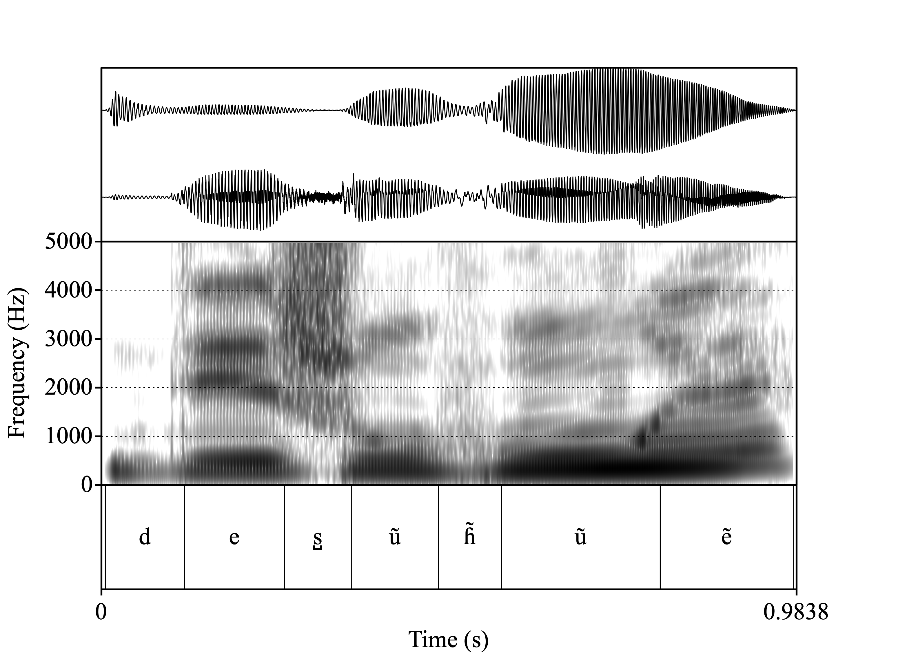

```{r setup, include=FALSE} 
options(htmltools.dir.version = FALSE)
knitr::opts_chunk$set(echo = FALSE)
```
```{r xaringanExtra}
xaringanExtra::use_webcam()
xaringanExtra::use_tile_view()
```
```{r}
`%>%` <- magrittr::`%>%`
```


name: title
class: center
background-image: url(img/logo-cnrs.png), url(img/iker_sinadura.png), url(img/logo-lmu.png), url(img/logo-ehu-gardena-2.png), url(img/logo-uppa.jpg)
background-position: 5% 93%, 50% 93%, 18% 93%, 78% 93%, 95% 93%
background-size: 8%, 18%, 15%, 17%, 15%
background-color: darkgrey

# Documenting rare linguistic phenomena: a nasalance-based study of Zuberoan /.ipa[h]/ vs. /.ipa[h̃]/ opposition

<div style = "position:fixed; left:30%; bottom:35%; font-size:115%; text-align:center">
Ander Egurtzegi
<br>
ander.egurtzegi@iker.cnrs.fr
<br><br>
Andrea García-Covelo
<br>
andrea.garcia@phonetik.uni-muenchen.de
<br><br>
Iñigo Urrestarazu-Porta
<br>
inigo.urrestarazu-porta@iker.cnrs.fr
</div>
<br><br><br><br><br><br><br><br><br><br><br><br>
.fancy[Vigo | 22-06-2023]
<!-- this ends up being the title slide since seal = FALSE-->

---

# Glottal fricatives

```{r glottal-fricative, fig.show = "hold", fig.align = "center", out.height="75%"}

```
---
class: center
background-image: url(img/h-distribution-world.png)
background-position: 50% 50%
background-size: cover

# /.ipa[h]/ in the world's languages
<div style = "position:fixed; left: 30px; bottom:30px; font-size:80%">
Moran, Steven & McCloy, Daniel (eds.). 2019. <em>Phoible 2.0</em>. <a href="http://phoible.org">http://phoible.org</a>
</div>

---

# How about a nasalized glottal approximant /.ipa[h̃]/?
<div style = "position:fixed; left:30px; bottom:30px; font-size:80%; text-align:left">
Walker, Rachel & Pullum, Geoffrey K. 1999. Possible and Impossible Segments. <em>Language</em> 75(4). 764-780. doi: <a href="https://doi.org/10.2307/417733">10.2307/417733</a>
</div>
--

```{r nasal-glottal, fig.show = "hold", fig.align = "center"}

```

???

Walker & Pullum 1999

The impossibility attributed to /˜h/ is rooted in the aerodynamic definition of nasality; whether or not enough air-stream can go through the nasal cavity once it has produced glottal friction and after it has been divided between the nasal and the oral tract. However, nasalized aspirates are not as problematic from an aerodynamic perspective, where any sound produced with a lowered velum can be considered nasal.

---
class: center
background-image: url(img/h-nasal-distribution-world.png)
background-position: 50% 50%
background-size: cover

# /.ipa[h̃]/ in the world's languages
<div style = "position:fixed; left: 30px; bottom:30px; font-size:80%">
Moran, Steven & McCloy, Daniel (eds.). 2019. <em>Phoible 2.0</em>. <a href="http://phoible.org">http://phoible.org</a>
</div>

---
class: center
background-image: url(img/ikurrina.png), url(img/h-nasal-distribution-world-basque.png)
background-position: 6% 38%, 50% 50%
background-size: 2%, cover

# /.ipa[h̃]/ in the world's languages
<div style = "position:fixed; left: 45px; top:210px; font-size:80%; color:red">
AND (EASTERN)<br>BASQUE!
</div>

<div style = "position:fixed; left: 30px; bottom:30px; font-size:80%">
Moran, Steven & McCloy, Daniel (eds.). 2019. <em>Phoible 2.0</em>. <a href="http://phoible.org">http://phoible.org</a>
</div>
---
class: animated, slideInDown

# Let's listen to them

<div style = "position:fixed; left: 240px; top:140px; font-size:120%">
<strong>Oral</strong>
</div>
<div style = "position:fixed; left: 800px; top:140px; font-size:120%">
<strong>Nasalized</strong>
</div>

.pull-left[


<figure>
<audio controls>
	<source src="img/0003-299-aihai-cut.m4a">
</audio>
     <figcaption>aihai 'dinner'</figcaption>
</figure>
]
.pull-right[


<figure>
<audio controls>
	<source src="img/0003-64-ihitza-cut.m4a">
</audio>
     <figcaption>ihitza 'dew'</figcaption>
</figure>
]

---

class: animated, slideOutLeft
background-image: url(img/red-dot.png), url(img/red-dot.png), url(img/black-line.png)
background-position: 40% 50%, 80% 50%, 100% 50%
background-size: 5%, 5%, 75%

# Chronology
<div style = "position:relative; left: -110px; top:130px; text-align:center; font-size:110%">
500-800 AD
<br>
<br>
<br>
<br>
Lenition of intervocalic /n/
<br>
<br>
/VnV/ > /V.ipa[h̃]V/
</div>

<div style = "position:relative; left: 335px; top:-60px; text-align:center; font-size:110%">
1000-1300 AD
<br>
<br>
<br>
<br>
Laryngeal loss
<br>
only in post-tonic syllables
<br>
in (Central-)Eastern varieties
<br>
<br>
/.ipa[h]V.'.ipa[h]V..ipa[h]V/ > /.ipa[h]V..ipa[h]V.V/
</div>

---

class: animated, slideInRight, animated.slow
background-image: url(img/red-dot.png), url(img/red-dot.png), url(img/black-line.png)
background-position: 25% 50%, 75% 50%, 0% 50%
background-size: 5%, 5%, 75%

#  

<div style = "position:relative; left: -295px; top:130px; text-align:center; font-size:110%">
1600-1900 AD
<br>
<br>
<br>
<br>
Loss of nasality (in aspirates)
<br>
in most Basque varieties
<br>
<br>
/V.ipa[h̃]V/ > /V.ipa[h]V/
</div>

<div style = "position:relative; left: 275px; top:-85px; text-align:center; font-size:110%">
Today
<br>
<br>
<br>
<br>
Nasalization of aspirates
<br>
preserved in Zuberoan and Mixean
<br>
<br>
e.ipa[h]i 'finger' vs. e.ipa[h̃]i 'easy'
</div>

---

<div style = "position:fixed; left: 30px; bottom:30px; right:50px; font-size:71%; text-align:left">
Hualde, José Ignacio. 1993. Topics in Souletin phonology. In J.I Hualde & J. Ortiz de Urbina (eds.) <em>Generative Studies in Basque Linguistics</em>, pp. 289-327. John Benjamins.
<br>
Egurtzegi, Ander. 2013. Diferentes tipos de aspiración en vasco (con análisis espectrales del dialecto suletino actual) [Different kinds of aspiration in Basque (with spectral analyses of the modern Zuberoan dialect)]. In Blasco <em>et al</em>. (eds.), Iberia e Sardegna. Firenze: Le Monnier. 151–169.
<br>
Egurtzegi, Ander. 2018. On the phonemic status of nasalized /.ipa[h̃]/ in Modern Zuberoan Basque. <em>Linguistics</em> 56. 1353-1367. doi: <a href="https://doi.org/10.1515/ling-2018-0024">10.1515/ling-2018-0024</a>
<br>
Egurtzegi, Ander & Carignan, Christopher. 2020. A typological rarity: the /.ipa[h]/ vs /.ipa[h̃]/ contrast of Mixean Basque. <em>Labphon</em> 17.
<br>
Egurtzegi, Ander. 2023. /.ipa[h̃]/ hasperen sudurkarituaren inguran [On the nasalized aspiration /.ipa[h̃]/]. <em>International Journal of Basque Linguistics and Philology</em> 57.
</div>

# Phonetic research: previous studies

--

<br> <br>
A handful of illustrative spectrograms (Egurtzegi 2013, 2023)

<br>
One acoustic analysis of /.ipa[h]/ vs /.ipa[h̃]/ (Egurtzegi & Carignan 2020)


???
Mainly impressionistic

Larrasquet (1932): Ṽh̃Ṽ vs VhV but everything nasalized 

Hualde (1993): h̃ based in the assumption that nasality spreads to adjacent vowels in Basque

Historical research h < *n

Yet, the acoustic analysis are not optimal for studying nasality
Record in Larraine to fill the gap

---
background-image: url(img/pink-box.png)
background-position: 50% 30%
background-size: 90%
# Research is pressing
<div style = "position:relative; left: 0px; top:80px; font-size:150%; text-align:center">
Basque is an endangered language (vulnerable according to UNESCO)
</div>


---
background-image: url(img/pink-box.png), url(img/pink-arrow.png), url(img/pink-square.png)
background-position: 50% 30%, 20% 50%, 10% 86%
background-size: 90%, 10%, 37%
# Research is pressing
<div style = "position:relative; left: 0px; top:80px; font-size:150%; text-align:center;">
Basque is an endangered language (vulnerable according to UNESCO)
</div>

<div style = "position:relative; left: -10px; top:285px; font-size:150%"; text-align:"center">
(Almost?) All Basque varieties
<br>
other than the standard
</div>
---

background-image: url(img/pink-box.png), url(img/pink-arrow.png), url(img/pink-square.png), url(img/red-arrow.png), url(img/red-square.png)
background-position: 50% 30%, 20% 50%, 10% 86%, 80% 50%, 90% 86%
background-size: 90%, 10%, 37%, 10%, 37%
# Research is pressing
<div style = "position:relative; left: 0px; top:80px; font-size:150%; text-align:center;">
Basque is an endangered language (vulnerable according to UNESCO)
</div>

<div style = "position:relative; left: -10px; top:285px; font-size:150%"; text-align:"center">
(Almost?) All Basque varieties
<br>
other than the standard
</div>

<div style = "position:relative; left: 300px; top:170px; font-size:150%; text-align:center; color:white;">
Particularly
<br>the Basque varieties
<br>spoken in the
<br>Northern Basque Country
<br>
in France
</div>

---

# Research questions

Is nasalization of aspirates still found in Zuberoan variaties of Basque? 

--

Is nasalization of aspirates still found in Larraine Basque?

--

<br><br>
If so, let's describe it


---
class: inverse

## A note on Larraine
.center[
<video show controls disablepictureinpicture width="640" height="480">
<source src="img/zoom-larraine.mp4" type="video/mp4" align="center">
</video>
]
???
Aim: Locate Larraine in the map

Further data:

  Zuberoan population: 12716
  
  Larraine: 195
  
  Passive knowledge: 22.8%
  
  Effective usage: 5.8%
  
  Speakers among the oldest population
  
---
class: center, middle
# Experimental design

--

## Stimuli + SpeechRecorder + Nasalance device

???
Experiment = word reading task

---

## Stimuli: wordlist

<div class="row">
  <div class="column">
    <h2>
    Oral
    </h2>
    <p>
    behi 'cow'</p>
    <p>bihotz 'heart'</p>
    <p>ehi 'finger'</p>
  </div>
  
  <div class="column"">
    <h2>Nasalized</h2>
    <p>
    ahate 'duck'</p>
    <p>
    ihaute 'carnival'</p>
    <p>ehi 'easy'
  </div>
  
  <div class="column"">
    <h2>Assimilated</h2>
        <p>
    uɲhu 'onion'</p>
        <p>
    lehen 'first, before'</p>
    <p>nihaur 'me, myself'</p>
  </div>
</div>


---

background-image: url(img/larrasquet.png)
background-position: 50% 50%
background-size: 22%

## Stimuli: source
<div style = "position:fixed; left: 30px; bottom:30px; font-size:80%">
Larrasquet, Jean. 1939. <em>Le Basque de la Basse-Soule Orientale</em>. Paris: C. Klincksieck.
</div>

---
background-image: url(img/larrasquet.png), url(img/basse-soule.png)
background-position: 20% 35%, 50% 50%
background-size: 10%, 25%

## Stimuli: source

---

background-image: url(img/larrasquet.png), url(img/basse-soule.png), url("img/haut-soule.png")
background-position: 10% 35%, 35% 40%, 70% 50%
background-size: 10%, 15%, 30%

## Stimuli: source

---
background-image: url("img/speech-recorder-behi.jpg"), url("img/speech-recorder-uhue.jpg")
background-position: 10% 50%, 90% 50%
background-size: 43%, 43%

## Prompting: SpeechRecorder
<div style = "position:fixed; left: 30px; bottom:30px; font-size:80%">
Draxler, Christoph & Jänsch, Klaus. 2004 SpeechRecorder - a Universal Platform Independent Multi-Channel Audio Recording Software. In <em>Proc. of
LREC</em>. 559-562. <a href="https://www.bas.uni-muenchen.de/Bas/software/speechrecorder/">https://www.bas.uni-muenchen.de/Bas/software/speechrecorder/ </a>
</div>

???
SpeechRecorder

Randomized order

checked with a Zuberoan informant

French translation, because of potentially unknown words, different pronuntiation, iliterate Basque

No graphic differentiation between oral or nasal segments

---
background-image: url(img/nasalance.jpg)
background-position: 50% 50%
background-size: 75%

## Nasalance device

<div style = "position:fixed; left: 30px; bottom:30px; font-size:80%">
Glotal Enterprises NAS-1 SEP. <a href="https://www.glottal.com/theNASSystem.html#">https://www.glottal.com/theNASSystem.html#</a>
</div>

---
background-image: url(img/nasalance-front.jpeg), url(img/nasalance-side.jpg)
background-position: 0% 50%, 100% 50%
background-size: 52%, 50%
class: right

## Nasalance device


---
background-image: url(img/setup.jpg)
background-position: 50% 50%
background-size: cover

# The setup

---
class: inverse, middle, center, animated, bounceInDown

# Data analysis


---
## Participants


     
<div style = "position:fixed; left: 30px; bottom:30px; font-size:80%">
<a href="https://stablecog.com">https://stablecog.com</a>
</div>


???
5 participants

60-70 yo

4 male : 1 female

L1 Larraine Basque

L2 French at age 5

Left Larraine or Zuberoa for work, but returned

---

## The data
.pull-left[


<figure>
<audio controls>
	<source src="img/aihaia.wav">
</audio>
     <figcaption>aihaia 'dinner'</figcaption>
</figure>
]
.pull-right[


<figure>
<audio controls>
	<source src="img/desuhue.wav">
</audio>
</audio>
     <figcaption>desuhue 'dishonor'</figcaption>
</figure>
]

---

<div style = "position:fixed; left: 30px; bottom:30px; font-size:80%">
Boersma, Paul & Weenink, David. 2022. <em>Praat. Doing phonetics by computer</em>. <a href="https://www.praat.org">https://www.praat.org</a>
<br>
R Core Team. 2022. <em>R: A language and Environment for Statistical Computing</em>. <a href="https://www.R-project.org/">https://www.R-project.org/</a>
<br>
Wickhan, Hadley <em>et al.</em>. 2019. Welcome to the tidyverse. <em>Journal of Open Source Software</em> 43(4). doi: <a href="https://doi.org/10.21105/joss.01686">10.21105/joss.01686</a>
</div>

## The data

Band-pass filter (80-10000 Hz)

--

Two measurements:

-   $NasalM = \frac{A_n}{\bar{A}_{token}}$

-   $Nasalance = \frac{A_n} {A_n + A_o} \times 100$

--

$z = \frac{x - \bar{x}_{participant}} {sd_{participant}}$


---

## The data

### N
```{r}
library(magrittr)
load("../data/hdata-m-new-sp-encoding-1.RData")
nrow(hdata.m.new_sp_encoding)
```

--

.pull-left[
### By category
```{r}
hdata.m.new_sp_encoding %>% dplyr::count(etym_asp)
```
]

--

.pull.right[
### By speaker
```{r}
hdata.m.new_sp_encoding %>% dplyr::group_by(speaker_new) %>% dplyr::count(etym_asp) %>% tidyr::pivot_wider(names_from = etym_asp, values_from = n)
```
]

---

## Bayesian generalized mixed-effects model with brms: variables

```{r formula, echo=FALSE}
load("../output/nasl.mod.RData")
load("../output/nasM.mod.RData")
nasl.mod$formula
nasM.mod$formula
```

<div style = "position:fixed; left: 30px; bottom:30px; font-size:80%">
Bürkner, Paul-Christian. 2017. brms: An R Package for Bayesian
  Multilevel Models Using Stan. <em>Journal of Statistical Software</em> 80(1). 1-28. doi: <a href="https://doi.org/10.18637/jss.v080.i01">10.18637/jss.v080.i01</a>
</div>

---

background-image: url(img/tools.jpg)
background-position: 100% 50%
background-size: 50%

## Further specs

8 chains of 10000 iterations (5000 warm-up)

8 chores

delta = 0.999

max. tree depth = 12

???
2 Bayesian generalized mixed-effects models

Response variables: nasalance.z.median, nasal.m.z.median

TRIAL for potential differences due to earlier vs later in experiment

---
background-image: url(img/prior-beta.png), url(img/prior-sd.png), url(img/prior-correlation.svg)
background-position: 5% 50%, 50% 50%, 95% 50%
background-size: 30%, 30%, 32%

## Bayesian generalized mixed-effects model: the priors

```{r priors, message=FALSE, warning=FALSE}
library(magrittr)
library(ggplot2)

range <- seq(-10, 10, 0.05)

b <- distributional::dist_student_t(df = 5, mu = 0, sigma = 2)
b.plot <- tibble::tibble(x = range,
               y = unlist(density(b,
                                  range))) %>%
  ggplot(aes(x, y)) +
  geom_line() +
  theme_bw() +
  labs(x = "", y = "Density", title = "Prior effect distributions",
       caption = "student-t distribution, df = 5, mu = 0, sd = 2")

sds <- distributional::dist_truncated(
  distributional::dist_student_t(df = 3,
                                 mu = 0,
                                 sigma = 2.5), lower = 0)

sds.plot <- tibble::tibble(
  x = range,
  y = density(
    sds,
    at = range) %>%
    unlist()) %>%
  ggplot(aes(x = x, y = y)) +
  geom_line() +
  theme_bw() +
  labs(x = "", y = "Density", title = "Prior SD distributions",
       caption = "student-t distribution, df = 3, mu = 0, sd = 2.5") +
  xlim(0, 12)

ggsave("img/prior-beta.png", plot = b.plot)
ggsave("img/prior-sd.png", plot = sds.plot)

```


---
class: inverse, middle, center, animated, bounceInDown

# Results


---
background-image: url(img/posteriors_nasalance.png), url(img/posteriors_nasalm.png)
background-position: 9% 50%, 91% 50%
background-size: 45%, 45%

## Posterior distributions

???
Show that both models are fairly similar
Just focus on one

---
background-image: url(img/posteriors_nasalance.png)
background-position: 50% 50%
background-size: 80%


---

background-image: url(img/nasalm-z-median-per-etym-asp--boxplot-and-beeswarm-2.png)
background-position: 50% 50%
background-size: 80%


---

background-image: url(img/nasalm-z-median-per-etym-asp--boxplot-and-beeswarm-2_shade.png)
background-position: 50% 50%
background-size: 80%


---
background-image: url(img/nasalance-z-median-per-words-with-nasal-and-oral-aspirates.png)
background-position: 50% 50%
background-size: 80%


---
background-image: url(img/nasalance-z-median-per-words-with-nasal-and-oral-aspirates_oral.png)
background-position: 50% 50%
background-size: 80%


---
background-image: url(img/nasalance-z-median-per-words-with-nasal-and-oral-aspirates_nasal.png)
backround-position: 65% 60%
background-size: 80%

---
background-image: url(img/nasalance-z-median-per-words-with-nasal-and-oral-aspirates_ohol.png)
backround-position: 65% 60%
background-size: 80%


---

# Discussion

There is an opposition between /.ipa[h]/ and /.ipa[h̃]/!

--

Etymologically oral aspirates ≠ Assimilated nasal aspirates ≈ Etymologically nasalized aspirates

--

### BUT:

Not all speakers produce nasalized aspirates to the same extent

--

Compared with Larrasquet's lexicon, some lexical items have lost nasalization

---

# Acknowledgements
DFG-AHRC project: *Speakers, Listeners, Languages: Patterns of Variability and Contrast in Spoken Language Dynamics* (Prof. Dr. Marianne Pouplier, IPS, LMU Munich).

Basque Summer Tutorial in Language Documentation

Maider Bedaxagar

Azler García-Palomino

The kind and patient people from Larraine


---
background-image: url(img/qrcode-pubs.png), url(img/qrcode-paper.png)
background-position: 5% 50%, 95% 50%
background-size: 35%, 35%

## Download the papers at egurtzegi.github.io (it's free!)


<br><br><br>
.center[
&larr; Ander's publications


The nasalance paper &rarr;
]

